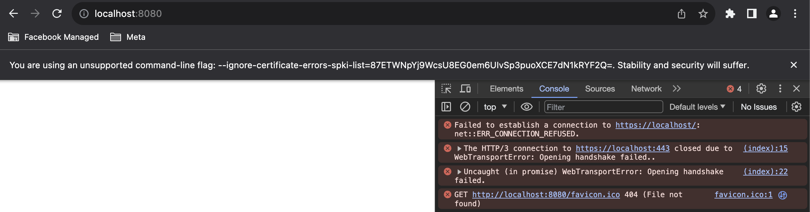

# simple-wt-server

This code just a (alleged) but in (webtransport-go) that prevents Chrome to establish a WT session

## Repro steps

- Clone this repo

- Create certs

```bash
cd scripts
./create-server-certs.sh
```

- Run chrome allowing localhost certs & connections to QUIC on localhost:443 (on terminal 1)

```bash
cd scripts
./start-localhost-test-chrome.sh
```

- Run simple local webserver (on terminal 2)

```bash
./start-http-server-cross-origin-isolated.py
```

- Load following webpage `index.html` (just tries to connects WT to localhost:443)

See results:



PS: I have used following Chrome `Version 119.0.6045.123 (Official Build) (arm64)`
